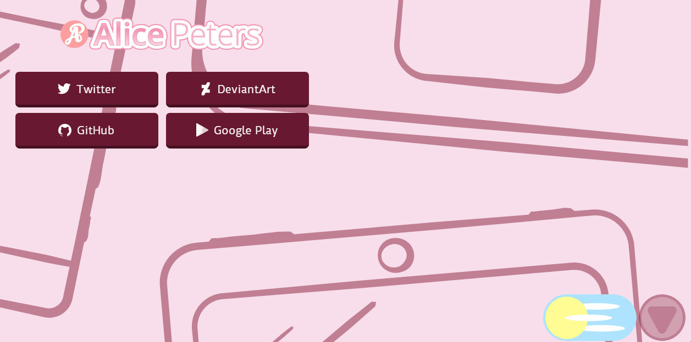

# SVG Dark Theme Switcher
This is an animated dark theme / light theme switcher made in SVG.  
It sets a cookie (themeStyle) with the value light or dark that can then be used client- or server side.  

## Usage:
```html
<object data="switch.svg" width="100" type="image/svg+xml"></object>
```
  
[View Demo](https://alicepeters.de/demo/DTSwitcher/)  

  
  
  

<small>Inspired (and designed to look similar) by https://codepen.io/bnthor/pen/WQBNxO</small>